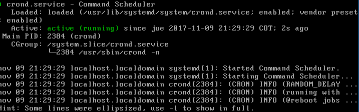
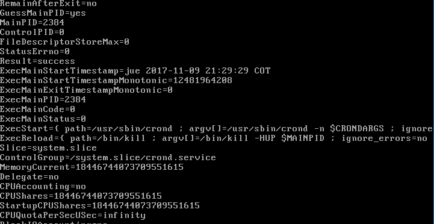
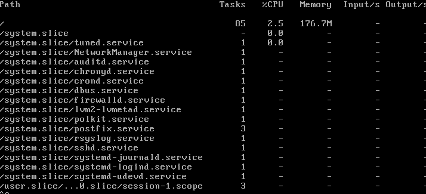
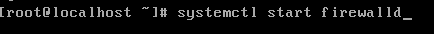

### Examen 2
**Universidad ICESI**  
**Curso:** Sistemas Operativos  
**Docente:** Daniel Barragán C.  
**Tema:** Comandos de Linux, Virtualización  
**Nombre:** Carlos Andrés Torres López  
**Código:** A00141804
**Url Git-hub:** https://github.com/candrelopez/so-exam2/tree/A00141804

Parcial Sistemas operativos  

3. Realice una prueba de concepto empleando systemd y el recurso de control CPUQuota teniendo en cuenta los requerimientos que se describen a cotinuación. Incluya evidencias del funcionamiento de lo solicitado (30%):
 * Las pruebas se realizaran sobre un solo núcleo de la CPU
 * Se deben ejecutar dos procesos
 * Cada proceso debe poder acceder solo al 50% de la CPU
 * Cuando uno de los procesos se cancela, el que continua ejecutándose no debe acceder a mas del 50% de la CPU
 R://
 
 primero reviso la cantidad de servicios que se estan corriendo dentro de la maquina con el comando:
 
 systemctl -t service list-units --all y esto da como resultado lo siguiente:
   
   
   
luego de eso con el comando systemctl start crond , inicio el proceso, y con el comando sytemctl crond reviso el estado del proceso
como se evidencia a continucación:

  

luego de esto con el comando systemctl show crontad muestro toda la indormación del servicio crontad y se ve claramente que la asignación de cpu no tiene limite:  

  
  
Con el siguiente comando asigno la cuota de CPU al servicio:  

 

y con el comando systemd-cgtop y me muestra lo siguiente:

  

luego de esto se inicial el proceso de firewalld  
  
   
Y se se asigna a este proceso un 50% de cuota de cep de la misma manera con el comando systemcl set-property firewalld CPUQuota=50%
 
4.  Realice una prueba de concepto empleando systemd y el recurso de control CPUShares teniendo en cuenta los requerimientos que se describen a continuación. Incluya evidencias del funcionamiento de lo solicitado (30%):
 * Las pruebas se realizaran sobre un solo núcleo de la CPU
 * Se deben ejecutar dos procesos
 * Uno de los procesos tendrá el 25% de la CPU mientras que el otro tendrá el 75% de la CPU
 * Cuando uno de los procesos se cancela, el que continua ejecutándose debe poder llegar al 100% de la CPU
5. Por medio de las evidencias obtenidas en los puntos anteriores y de fuentes de consulta en Internet, elabore las definiciones para los grupos de control CPUQuota y CPUShares, además concluya acerca de cuando es preferible usar un recurso de control sobre otro (20%)

 
